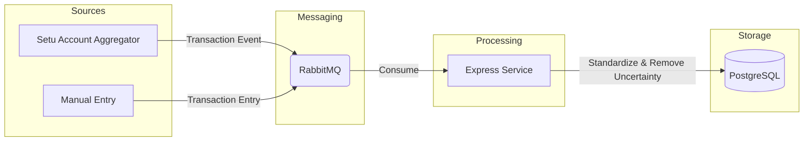
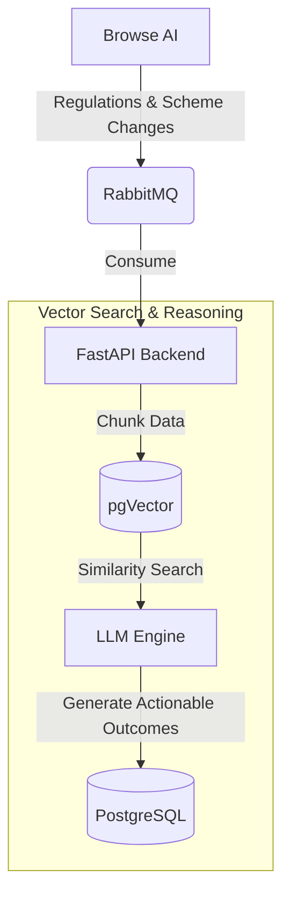
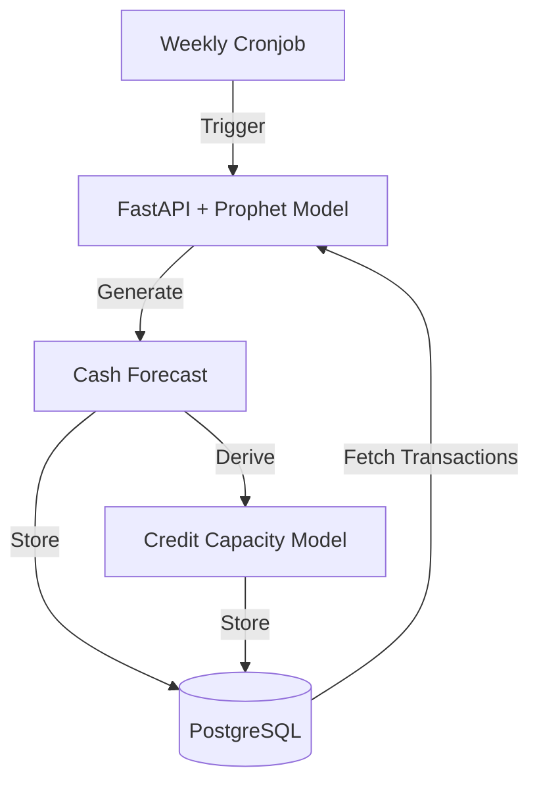
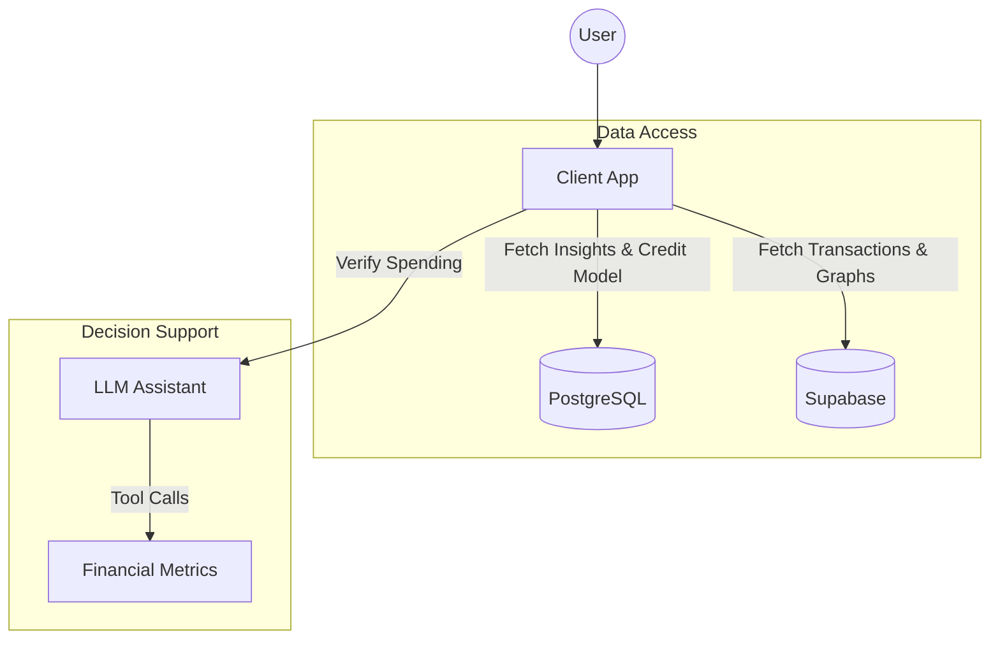

## Project Description

Design and build a scalable, secure, and intelligent FinTech platform that enables real-time **financial decision-making** for small businesses by ingesting heterogeneous data sources (transactions, user behavior, external signals), handling uncertainty and incomplete information, ensuring privacy and regulatory compliance, and delivering explainable, actionable outcomes. The system demonstrates strong system architecture, data handling, security, and performance, while incorporating AI for prediction, optimization, and reasoning, without relying solely on AI as the core solution.

  
  
<b>landing_page.png</b>

  
  
<b>credit-assesment.png</b>

  
  
<b>dashboard.png</b>

  
  
<b>decisionmaker.png</b>

  
  
<b>transactions.png</b>

## Features

*   **Unified Transaction Processing**: Seamlessly ingests data from Account Aggregators (Setu) and manual inputs so you have a single source of truth.
*   **Proactive Regulation Alerts**: Automatically monitors and interprets new financial regulations and government schemes relevant to your business.
*   **AI-Driven Forecasting**: Leverages Prophet ML models to predict cash flow trends and determine credit capacity on a weekly basis.
*   **Smart Decision Support**: Includes an LLM-powered assistant to help validate business expenses against your actual financial metrics.
*   **Comprehensive Dashboard**: Visualizes real-time financial health, transaction history, and credit potential.

## Architecture

### Transaction Flow

### Regulation Intelligence Flow

### Forecasting Flow

### Client Application Flow

